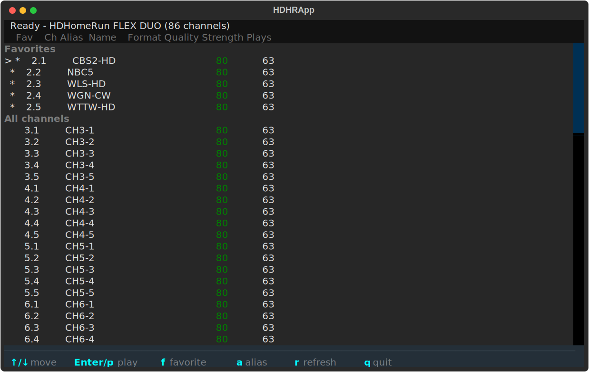
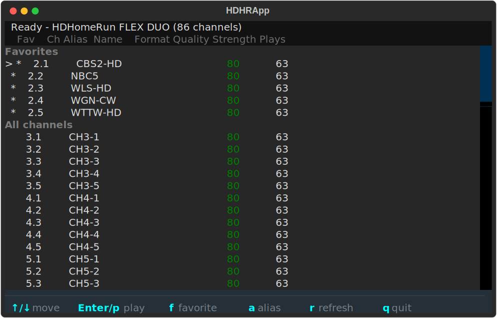

# play-hdhomerun-tui

A simple terminal app for watching live over-the-air TV from an HDHomeRun tuner. It finds the device on your network automatically, shows your channels with favorites and recent picks, and lets you watch two channels at the same time.

## Screenshots

The channel list at the target terminal size (100x30) and the minimum supported size (80x24). The keybinding hints stay pinned to the bottom row at both sizes.





These images are produced by [tests/e2e/e2e_tui_screenshot.py](tests/e2e/e2e_tui_screenshot.py), which renders frames into the scratch `output_smoke/` directory; the curated copies here are refreshed by copying those frames in.

## Documentation

- [docs/INSTALL.md](docs/INSTALL.md): prerequisites, install steps, and verify command.
- [docs/USAGE.md](docs/USAGE.md): run command, key bindings, and channel list layout.
- [docs/TROUBLESHOOTING.md](docs/TROUBLESHOOTING.md): common failures and how to recover.
- [docs/CODE_ARCHITECTURE.md](docs/CODE_ARCHITECTURE.md): system design, components, and data flow.
- [docs/FILE_STRUCTURE.md](docs/FILE_STRUCTURE.md): directory map and where to add new work.
- [docs/PYTHON_STYLE.md](docs/PYTHON_STYLE.md): Python coding conventions for this repo.
- [docs/REPO_STYLE.md](docs/REPO_STYLE.md): repo-wide organization and workflow rules.

## Quick start

Prerequisites: pip packages `textual` and `requests`; system packages `mpv` and `ffmpeg`.

```bash
source source_me.sh && python3 hdhr_tui.py
```

If the device does not answer `hdhomerun.local`, pass a hostname or IP directly:

```bash
source source_me.sh && python3 hdhr_tui.py --host <hostname-or-ip>
```

Arrow keys to pick a channel, Enter to play. See [docs/USAGE.md](docs/USAGE.md) for the full key map.
